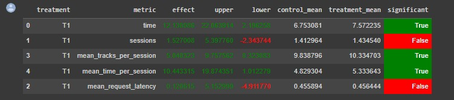

# 1. Abstract
Данное решение включает в себя два улучшения относительно Contextual бейзлайна:
1. Нейросетевой рекоммендер улучшен засчет добавления матричной факторизации в алгоритм:
   1. Теперь у нас три типа эмбедингов: юзер, текущий трек и трек-контекст (размерность увеличена до 150).
   2. По текущему треку и треку-контексту считаем скалярное произведение (как в Contextual)
   3. По текущему треку и юзеру считаем скалярное произведение
   4. Складываем полученные значения и передаем в сигмоиду
2. Если предыдущий трек не понравился пользователю (< 0.5), то он получит рекомендацию, построенную с помощью метода LightFM. Если и ее не окажется, тогда случайный трек.

# 2. Детали реализации

1. Модель нейросетевого рекомендера переобучена в ноутбуке `jupyter/Week4Seminar.ipynb`, с сохранением его первоначальной структуры.
2. Оцениваемый рекоммендер реализован в виде класса `MFContextualRecommender(Recommender)` в файле `botify/botify/recommenders/mf_contextual.py`.
3. Рекомендации, полученные переобученой моделью сохранены в файле `botify/data/tracks_with_recs_mf.json`. 
В качестве рекомендаций, полученных методом LightFM, берутся данные из файла `botify/data/recommendations.json`

# 3. Результаты AB эксперимента
В результате эксперимента получили значимый прирост целевой метрики (`mean_time_per_session`).

# 4. Эксперименты не вошедшие в итоговое решение:
1. Усложнение архитектуры нейронной сети за счет добавления линейных слоев и нелинейности (1,2 и 3 линейных слоя). В результате прирост не был получен.
2. Поиск оптимальной размерности эмбеддинга по равномерной сетке (10 вариантов в диапазоне от 10 до 500) - наибольшее качество на отложенной выборке получалось для размерности 150.
3. Подбор катофа, начиная с которого, мы считаем, что трек понравился пользователю в текущем сеттинге.

# 5. Инструкция по запуску
Аналогично предыдущим экспериментам:
1. Запустить контейнеры согласно инструкции в `botify/README.md`
2. Запустить эксперимент согласно инструкции в `sim/README.md`